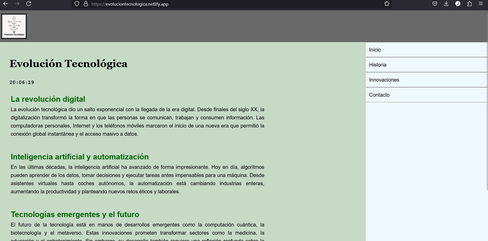

# 🌐 Evolución Tecnológica

https://evoluciontecnologica.netlify.app/



Este es un proyecto educativo desarrollado con HTML, CSS y JavaScript que tiene como objetivo ilustrar los principales avances en la historia de la tecnología, así como reforzar conceptos fundamentales de desarrollo web como estructura semántica, estilos, manipulación del DOM y validación de código.

---

## 📌 Contenido del proyecto

La página web está compuesta por los siguientes elementos:

- ✅ **Encabezado** con logotipo institucional.
- ✅ **Sección de artículos** sobre la evolución tecnológica (contenido dinámico generado desde un archivo JSON).
- ✅ **Reloj digital** en tiempo real implementado con JavaScript.
- ✅ **Menú de navegación lateral** con enlaces.
- ✅ **Pie de página** con dirección de contacto y validación CSS.

---

## 🧱 Estructura de carpetas
```
📁 proyecto-evolucion-tecnologica/
├── 📁 src/
│ └── 📁 images/
│ ├── logoET.png
│ └── logoW3C.png
├── 📁 styles/
│ ├── normalize.css
│ └── style.css
├── 📁 scripts/
│ └── main.js
├── 📁 data/
│ └── articulos.json
├── index.html
└── README.md
```

---

## 🛠️ Tecnologías utilizadas

- HTML5 (estructura semántica)
- CSS3 (estilizado y diseño responsive básico)
- JavaScript (reloj en tiempo real, generación de artículos con `fetch`)
- JSON (almacenamiento externo del contenido)
- Validador Nu Html Checker (para asegurar buenas prácticas)

---

## 🕰️ Funcionalidades destacadas

- **Carga dinámica de contenido** desde `articulos.json`, usando `fetch` y `forEach`.
- **Reloj digital** que se actualiza cada 10 segundos mostrando la hora actual.
- **Diseño dividido** en sección principal (75%) y barra lateral (25%).
- **Validación W3C CSS** accesible desde el pie de página.

---

## 🧪 Cómo probar el proyecto

1. Clona el repositorio o descarga los archivos.
2. Abre el archivo `index.html` en tu navegador.
3. Asegúrate de tener conexión local para que cargue las imágenes y el JSON correctamente.
4. Abre la consola del navegador para verificar que el reloj y los artículos se están cargando correctamente.

---

## ✅ Validación

Este proyecto fue validado con [Nu Html Checker](https://validator.w3.org/nu/) y el [validador de CSS del W3C](http://jigsaw.w3.org/css-validator/).

---

## ✍️ Autora
**Johana Sandoval**  
#### Proyecto educativo desarrollado como parte del certificado IFCD0110: Confección y Publicación de Páginas Web.
---
